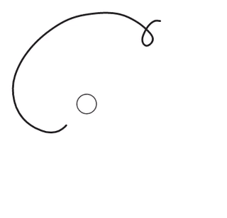

Utilities for negotiating between circles and polygons in SVG, using D3.

```bash
npm install cirque
```


## Functions

### geoToCircle

Converts the geometry to a _circle object_ centered on the shape's centroid.

_Circle objects_ take the form: `{ x, y, r }`

Positional arguments:
- geometry: any GeoJSON geometry or feature (required)
- path: [geographic path generator](https://github.com/d3/d3-geo#geoPath). Defaults to bare `d3.geoPath()`, which assumes pre-projected geometry
- radius: circle radius. Defaults to computing radius from `path.area(geometry)`
- object: mutates passed object rather than creating a new one

### circlePath

Converts the passed _circle object_ to an SVG path string (i.e. a _circle path_ consisting of two arc commands).

### interpolatePath

Interpolates between two SVG path strings. Supports _circle paths_ (which are sampled) and polygons (which are oversampled when necessary).

### interpolatePaths

Individually interpolates (using `interpolatePath`) between corresponding items in two parallel arrays of SVG path strings.

### avoidOverlap

Pass an array of _circle objects_ to separate colliding circles so that no overlaps remain. Uses `d3.forceCollide`. Mutates objects in place.

### radiusScale

Receives total area and total value as arguments, and returns a D3 scale in which the area of a circle with the given radius linearly corresponds to a value.


## Examples
```js
let render  // Given a function that renders a set of SVG paths
let path    // Given a geo path generator
```

### Example: geometry
```js
import { geoToCircle, circlePath, interpolatePath } from 'cirque'

let geometry  // Given a GeoJSON Polygon or MultiPolygon geometry

const interpolator = interpolatePath(
  path(geometry),
  circlePath( geoToCircle(geometry, path) )
)

d3.transition().tween('shape', () => t => { render([ interpolator(t) ]) })
```

### Example: features

```js
import * as cirque from 'cirque'

let features  // Given an array of GeoJSON Polygon or MultiPolygon features

const scale = cirque.radiusScale( path.area(mergedFeatures), 7.5e9 )
const circles = features.map(feature =>
  circle.geoToCircle(feature, path, scale(feature.properties['population']))
)

const separatedCircles = cirque.avoidOverlap(circles)
const circlePaths = separatedCircles.map(cirque.circlePath)
const interpolator = cirque.interpolatePaths(features.map(path), circlePaths)

d3.transition().tween('shapes', () => t => { render( interpolator[i](t) ) })
```


## Rationale

Just as a lack of color is physically considered _black_ (though artistically often considered _white_), a lack of shape can in a certain sense be considered a _circle_ (or a n-sphere generally): there is no discrete segmentation and no starting point better justified than another.

This shapelessness is desirable for comparing values in a controlled way (such as in a bubble map) to minimize distortion and distraction.

The tools in this package amount to a method for switching between precise forms, such as geographic areas, and corresponding value-sized bubbles, while maintaining constancy.
